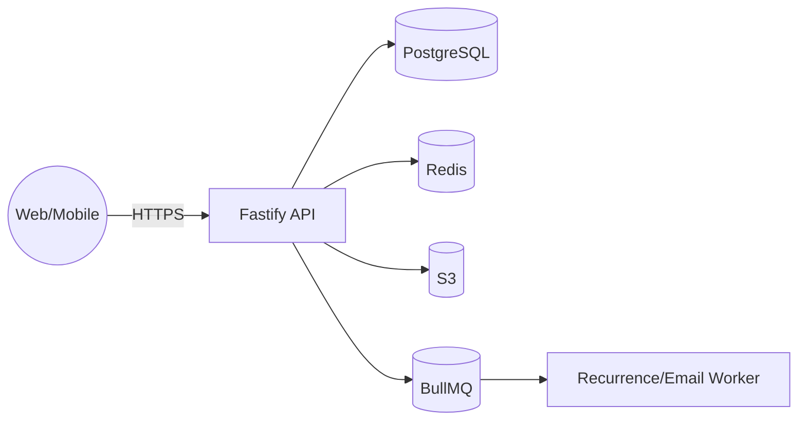

## 1. 시스템 개요 (3C 관점)

- **Context**: 사용자(웹·모바일) ↔ API ↔ DB/스토리지/작업큐
- **Container**: Web(Next.js) / API(Fastify/Node) / DB(PostgreSQL) / Cache(Redis) / Object Storage(S3) / Worker(BullMQ)
- **Component**: Timeline Service, Recurrence Engine, Share Service, Auth/ACL, Analytics Collector

